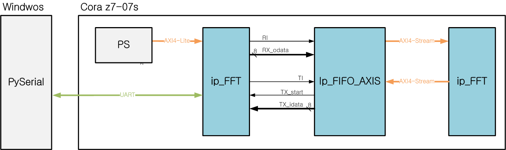
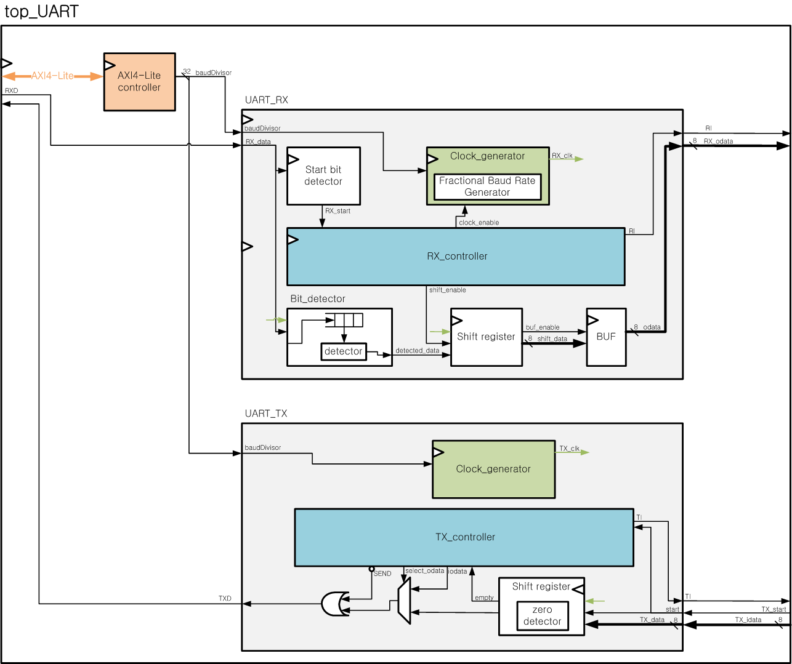

# FPGA-UART

UART RTL과 UVM 검증 환경을 관리하는 프로젝트입니다. 아래 실행 예시는 **UART_rx**, **Cora Z7-07S** 보드를 기준으로 합니다. 보드 디바이스는 `xc7z007sclg400-1`이며, `--board`로 지정한 디렉터리의 `board.xml`에서 자동으로 읽습니다.

## 1. 파일 구조

```text
FPGA-UART/
├── FPGA/
│   └── cora-z7-07s/
│       ├── master.xdc                 # 보드 핀·클록 제약
│       └── board/B.0/
│           ├── board.xml              # 보드 정보와 FPGA 디바이스명
│           ├── part0_pins.xml          # 보드 핀 정보
│           └── preset.xml              # 보드 설정
├── UART/
│   ├── rtl/
│   │   ├── UART_rx.sv                 # RX 최상위 모듈
│   │   ├── rx_clock_generator.sv      # RX 클록 생성
│   │   ├── rx_controller.sv           # RX 제어
│   │   ├── top_UART.sv
│   │   ├── tx_UART.sv
│   │   ├── axi_UART.sv
│   │   └── axi_lite_reg.v
│   └── sim/
│       ├── UART_rx/
│       │   ├── tb_UART_rx.sv          # DUT 연결, 클록·리셋, UVM 실행
│       │   ├── tb_UART_rx_pkg.sv      # RX UVM 패키지
│       │   ├── tb_UART_rx_files.f     # 컴파일 파일 목록
│       │   ├── uvm_UART_rx_if.sv      # RX 인터페이스
│       │   ├── uvm_UART_rx_driver.svh
│       │   ├── uvm_UART_rx_monitor.svh
│       │   └── UART_rx_sim.wcfg       # 파형 표시 설정
│       ├── UVM/
│       │   ├── UART_pkg.sv
│       │   ├── UART_item.svh
│       │   ├── UART_observation.svh
│       │   ├── UART_sequence.svh
│       │   ├── UART_sequencer.svh
│       │   ├── UART_agent.svh
│       │   ├── UART_env.svh
│       │   ├── UART_scoreboard.svh
│       │   └── UART_test.svh
│       └── rx_controller/
│           ├── tb_rx_controller.sv    # 일반 SystemVerilog TB
│           └── rx_controller_sim.wcfg
├── doc/
│   ├── architecture.png
│   └── UART_blockDiagram.png
├── behavior.bat                      # RTL/TB 컴파일 및 snapshot 생성
├── behavior_sim.bat                  # Behavioral 시뮬레이션
├── systhesis.bat                     # 합성 및 기능 netlist 생성
├── systhesis_sim.bat                 # 합성 후 기능 시뮬레이션
├── implementation.bat               # 배치·배선 및 timing netlist/SDF 생성
├── implementation_sim.bat           # 배치·배선 후 타이밍 시뮬레이션
├── .gitignore
└── README.md
```

실행 결과는 아래 폴더에 생성되며 Git 추적에서 제외합니다.

| 단계 | 저장 경로 |
| --- | --- |
| Behavioral 준비·시뮬레이션 | `.behav/UART_rx/` |
| 합성 | `.synth/UART_rx/xc7z007sclg400-1/` |
| 합성 후 시뮬레이션 | `.synth/UART_rx/xc7z007sclg400-1/sim/` |
| Implementation | `.imple/UART_rx/xc7z007sclg400-1/` |
| Implementation 후 시뮬레이션 | `.imple/UART_rx/xc7z007sclg400-1/sim/` |

## 2. 설계 이미지

### 전체 시스템 구성

PC의 PySerial, Cora Z7의 PS, UART 연결과 FIFO·AXI4-Stream·FFT 블록의 연결을 나타낸 구성도입니다. 현재 UART_rx 실행 예시보다 넓은 시스템 설계 범위를 표현합니다.



### UART 블록 구성

AXI4-Lite 제어와 UART RX/TX 내부의 클록 생성기, 제어기, 데이터 경로를 나타낸 블록 구성도입니다.



## 3. BAT 실행 방법

Windows에서 Vivado 도구(`vivado`, `xvlog`, `xelab`, `xsim`)가 PATH에 등록된 터미널을 사용합니다. 아래 명령은 프로젝트 루트에서 실행합니다. 기존 검증에는 Vivado 2022.1을 사용했습니다.

### Behavioral 검증

먼저 RTL과 UVM TB를 컴파일하고 simulation snapshot을 생성합니다. 준비 단계에서는 시뮬레이션을 실행하지 않습니다.

```powershell
.\behavior.bat UART_rx
```

준비된 snapshot을 실행합니다. RTL 또는 TB를 수정하면 `behavior.bat`을 다시 실행해야 합니다.

```powershell
.\behavior_sim.bat UART_rx
```

현재 UART_rx TB는 50 MHz 클록, 9600 baud, 8비트 데이터·패리티 없음·정지 비트 1개로 랜덤 8프레임을 전송합니다. scoreboard가 기대값과 수신값을 비교하며 최종 결과는 `RESULT: PASS / FAIL`로 표시합니다.

`behavior.bat`은 `tb_<모듈명>_files.f`가 있으면 UVM 방식으로 준비하고, 없으면 해당 RTL과 일반 TB를 사용합니다.

### 합성 및 합성 후 시뮬레이션

합성 시 UART_rx와 하위 RTL을 읽고, 보드 디렉터리의 두 단계 위에 있는 `master.xdc`를 적용합니다. 합성 checkpoint(`UART_rx_synth.dcp`), 기능 netlist(`UART_rx_synth.v`)와 자원·타이밍·DRC 보고서를 저장합니다.

```powershell
.\systhesis.bat UART_rx --board FPGA\cora-z7-07s\board\B.0
```

저장된 합성 netlist로 같은 UVM TB를 실행합니다. 이 단계는 합성을 다시 수행하지 않으며 배선 지연을 반영하지 않는 기능 시뮬레이션입니다.

```powershell
.\systhesis_sim.bat UART_rx --board FPGA\cora-z7-07s\board\B.0
```

### Implementation 및 배선 후 시뮬레이션

합성 checkpoint를 입력으로 최적화·배치·물리 최적화·배선을 수행합니다. 배선 완료 checkpoint(`UART_rx_impl.dcp`), timing netlist(`UART_rx_impl.v`), 지연 파일(`UART_rx_impl.sdf`)과 배선 상태·자원·타이밍·DRC 보고서를 저장합니다. Bitstream 생성은 포함하지 않습니다.

```powershell
.\implementation.bat UART_rx --board FPGA\cora-z7-07s\board\B.0
```

배선 netlist와 SDF의 최대 지연을 DUT에 적용해 UVM 타이밍 시뮬레이션을 실행합니다. 이 단계는 합성이나 implementation을 다시 수행하지 않습니다.

```powershell
.\implementation_sim.bat UART_rx --board FPGA\cora-z7-07s\board\B.0
```

RTL 또는 XDC를 수정했다면 합성을 다시 수행하고, 배선 후 검증에는 implementation도 다시 수행해야 합니다. 합성·implementation 코드는 BAT 안에 포함되어 있으며 실행에 사용하는 임시 Tcl 파일은 종료 후 삭제합니다.

### GUI 실행

`behavior.bat`을 제외한 나머지 BAT는 `--gui`를 지원합니다. 합성·implementation은 실행 결과를 Vivado GUI에서 확인하며, 시뮬레이션 GUI는 **Run All**로 실행합니다.

```powershell
.\behavior_sim.bat UART_rx --gui
.\systhesis.bat UART_rx --board FPGA\cora-z7-07s\board\B.0 --gui
.\systhesis_sim.bat UART_rx --board FPGA\cora-z7-07s\board\B.0 --gui
.\implementation.bat UART_rx --board FPGA\cora-z7-07s\board\B.0 --gui
.\implementation_sim.bat UART_rx --board FPGA\cora-z7-07s\board\B.0 --gui
```

### 클록 설정

보드 기본 외부 클록은 125 MHz이며 TB의 50 MHz 클록과는 별도입니다. 현재 `master.xdc`의 활성 `create_clock`은 6 ns 주기로 되어 있습니다. 이 값은 타이밍 분석 목표이며 실제 보드 클록을 변경하지 않습니다. 내부 `rx_clk` 및 나머지 입출력 제약은 별도로 정의해야 합니다.
